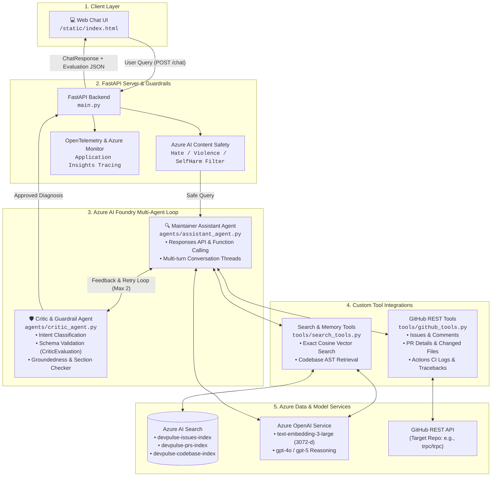

# 🚨 DevPulse: AI Engineering Intelligence Agent (Azure Edition)

An enterprise-grade, AI-powered maintainer copilot and repository intelligence system built on **Azure AI Foundry**, **Azure OpenAI (`gpt-4o` / `gpt-5` + `text-embedding-3-large`)**, **Azure AI Search**, and **FastAPI**. DevPulse automates GitHub repository triage, diagnoses complex issues, inspects pull requests, debugs CI build failures, and localizes bugs in source code using multi-agent ReAct orchestration and Tree-sitter AST indexing.

---

## 🌟 Why this project exists

Open-source maintainers and engineering teams spend hours each week manually triaging incoming issues, inspecting massive PR diffs, tracing CI test failures, and recalling past resolutions across thousands of lines of codebase context.

DevPulse acts as an autonomous engineering intelligence copilot that gathers real-time repository telemetry, searches historical vector memory, and inspects codebase syntax trees to produce grounded, verified technical diagnoses.

### The agent can:
* **Fetch real-time GitHub data**: Queries live issues, top discussion comments, PR diffs, and GitHub Actions CI workflow run error tracebacks.
* **Semantic memory search**: Queries historical issue resolutions in Azure AI Search with 3072-dimensional vector embeddings (`text-embedding-3-large`) and exact cosine relevance scoring ($\ge 0.75$ threshold).
* **AST Codebase localization**: Uses **Tree-sitter** to parse TypeScript, JavaScript, and Python into structural syntax trees (functions, classes, callers, line ranges) to pinpoint buggy source files.
* **2-Agent collaborative loop**: Orchestrates an **Assistant ReAct Agent** with a dedicated **Critic & Guardrail Agent** in Azure AI Foundry that verifies reasoning, groundedness, and required diagnostic sections before delivery.
* **Interactive Web Chat UI**: Delivers multi-turn maintainer assistance with conversation history, intent detection badges, and critic evaluation transparency.
* **Enterprise safety & tracing**: Pre-screens queries via **Azure AI Content Safety** and logs distributed traces via **OpenTelemetry & Azure Application Insights**.

---

## 🏗️ Architecture Overview



### High-level workflow:

1. **User Query**: User submits an issue number, PR number, or diagnostic request via the Web Chat UI or `/chat` endpoint.
2. **Safety Pre-Screen**: Azure AI Content Safety checks the query against harmful content categories.
3. **Assistant Agent Execution**: The Maintainer Assistant runs in Azure AI Foundry via the Responses API, autonomously selecting and invoking registered function tools.
4. **Tool Execution**:
   * Live GitHub data is fetched (Issue body, comments, PR diffs, CI error tracebacks).
   * Historical vector memory is queried using `text-embedding-3-large` and exact cosine thresholding.
   * Tree-sitter indexed codebase is queried for exact functions and line spans.
5. **Critic Evaluation**: The Critic Agent evaluates the draft response against a strict Pydantic JSON schema (`CriticEvaluation`), verifying query intent, groundedness, and required structural sections.
6. **Retry with Feedback**: If rejected, the critic's specific feedback is injected back into the conversation context (up to 2 retries).
7. **Response & Telemetry**: Approved response with evaluation metrics and trace spans is returned to the user and logged to Azure Application Insights.

### Core stack:

* **FastAPI** for high-throughput asynchronous REST API endpoints and background ingestion tasks.
* **Azure AI Foundry (Agent Service & Responses API)** for autonomous agent hosting, multi-turn conversation threads, and server-side tool execution.
* **Azure AI Search** for hybrid vector search with HNSW profiles across 3 dedicated indexes.
* **Azure OpenAI (`text-embedding-3-large`)** for 3072-dimensional dense vector embeddings.
* **Azure OpenAI (`gpt-4o` / `gpt-5`)** for deep multi-agent code reasoning and diagnosis generation.
* **Tree-sitter AST Engine** for syntactic code parsing across TypeScript, JavaScript, and Python.
* **Azure AI Content Safety** for real-time input threat screening.
* **OpenTelemetry & Azure Application Insights** for distributed execution tracing.

---

## 🤖 Key Features

### 🔍 2-Agent ReAct Loop (Assistant + Critic)
* **Maintainer Assistant Agent**: Operates as a tool-calling ReAct agent in Azure AI Foundry equipped with 5 specialized tools for live GitHub telemetry and vector memory.
* **Critic & Guardrail Agent**: Automatically classifies intent (`ISSUE_ANALYSIS`, `PR_REVIEW`, `CI_BUILD_DEBUG`, `GENERAL_QUERY`) and evaluates drafts for evidence groundedness, safety, and required diagnostic sections.
* **Context-Preserving Retry Loop**: If rejected, the critic's actionable feedback is prepended to the conversation thread, allowing the assistant to refine its diagnosis without losing prior context.
* **Safety Timeout Net**: Includes a 15-second ThreadPoolExecutor safety net to prevent agent hangs.

### 🧠 Semantic Memory & AST Codebase Indexing
* **3 Dedicated Azure AI Search Indexes**:
  * `devpulse-issues-index`: Historical GitHub issues and maintainer resolutions.
  * `devpulse-prs-index`: Historical pull request summaries and review comments.
  * `devpulse-codebase-index`: AST-parsed source code entities.
* **Tree-sitter AST Parser**: Extracts functions, classes, parent classes, called functions, line numbers, and code snippets from `.ts`, `.tsx`, `.js`, `.jsx`, and `.py` files.
* **Exact Cosine Distance Re-Scoring**: Computes exact cosine similarity directly on vector embeddings and applies a strict `0.75` threshold to eliminate hallucinated historical precedents.

### 🛡️ Enterprise Guardrails & Observability
* **Azure AI Content Safety**: Real-time REST pre-screening blocking Hate, SelfHarm, Sexual, and Violence categories.
* **OpenTelemetry Spans**: Custom span instrumentation tracking tool execution times, agent latency, and critic evaluation decisions.
* **Azure Application Insights**: Centralized cloud logging when `APPLICATIONINSIGHTS_CONNECTION_STRING` is configured.

### 💻 Glassmorphic Web Chat UI
* **Dark-mode Interface**: Designed with modern typography, smooth animations, and responsive layout.
* **Evaluation Diagnostics Drawer**: Displays real-time Intent badges, approval state, retry counter, and critic feedback.
* **Multi-Turn Continuity**: Maintains conversation threads via `conversation_id` across turns.

---

## 💡 Example Use Cases

* **Issue Root Cause Investigation**:
  > *"Tell me about Issue #96050. Locate the buggy function in the codebase and check if this is part of a recurring pattern."*
  * The agent fetches live issue data, searches past issues for similar bug patterns, searches the Tree-sitter code index, and presents the root cause, affected files, and recommended fix.

* **Pull Request Audit & Review**:
  > *"Analyze PR #7390. Summarize changed files, check mergeability, and inspect the implementation."*
  * Fetches changed files, diffs, additions/deletions, and verifies test coverage.

* **CI Build Failure Debugging**:
  > *"Why is CI failing on PR #4880?"*
  * Fetches latest GitHub Actions workflow runs, extracts failed test suites and error tracebacks, and suggests specific code fixes.

---

## 📁 Project Structure

```text
devpulse/
├── agents/
│   ├── agent_graph.py          # 2-agent loop orchestrator (Assistant + Critic validation & retry)
│   ├── assistant_agent.py      # Maintainer Assistant ReAct agent (Foundry Responses API + Tool calling)
│   └── critic_agent.py         # Critic & Guardrail agent (JSON schema validation & intent routing)
├── config/
│   ├── azure_clients.py        # Azure OpenAI, Search, and AI Foundry client singletons
│   └── settings.py             # Centralized environment configurations & endpoint definitions
├── scripts/
│   ├── create_indexes.py       # Azure AI Search index definitions (Issues, PRs, Codebase AST)
│   ├── ingest_history.py       # GitHub historical issue ingestion & vector embedding pipeline
│   ├── repo_indexer.py         # Tree-sitter AST codebase indexer (classes, methods, callers)
│   ├── run_eval_benchmark.py   # Batch benchmark evaluation against merged GitHub PR ground truth
│   └── test_single_eval.py     # Single PR ground-truth evaluation & LLM judge scoring
├── static/
│   └── index.html              # Modern Dark-mode Glassmorphic Web Chat UI
├── tools/
│   ├── github_tools.py         # Live GitHub REST API fetchers (Issues, PRs, Actions CI logs)
│   ├── register_tools.py       # Azure AI Foundry FunctionTool schema registration script
│   └── search_tools.py         # Semantic vector search with exact cosine scoring & AST search
├── main.py                     # FastAPI application server, endpoints & background tasks
├── requirements.txt            # Application Python packages
└── benchmark_results.json      # Ground-truth evaluation metrics and scoring results
```

---

## 🚀 Getting Started

### 1. Prerequisites
* Python 3.10+
* Azure OpenAI Service (with `text-embedding-3-large` and `gpt-4o` or `gpt-5` deployments)
* Azure AI Foundry Project with published `assistant-agent` and `critic-agent`
* Azure AI Search service
* GitHub Personal Access Token (for repository REST API access)

### 2. Installation

Clone the repository and install dependencies:

```bash
git clone https://github.com/Saifali111/AI-Repo-Intelligence-Agent-Azure.git
cd devpulse_Azure
python3 -m venv venv
source venv/bin/activate
pip install -r requirements.txt
```

### 3. Environment Configuration

Create a `.env` file in the root directory:

```env
# Azure OpenAI Service
AZURE_OPENAI_ENDPOINT=https://<your-openai-resource>.openai.azure.com/
AZURE_OPENAI_KEY=<your-azure-openai-key>
AZURE_OPENAI_API_VERSION=2024-10-21
AZURE_OPENAI_DEPLOYMENT_NAME=gpt-4o
AZURE_OPENAI_MINI_DEPLOYMENT=gpt-4o-mini
AZURE_OPENAI_EMBEDDING_DEPLOYMENT=text-embedding-3-large

# Azure AI Foundry Agent Service (Responses API)
AZURE_AI_PROJECT_ENDPOINT=https://<resource>.services.ai.azure.com/api/projects/<project-name>
AZURE_AI_AGENT_NAME=assistant-agent
AZURE_AI_CRITIC_NAME=critic-agent

# Azure AI Search
AZURE_SEARCH_ENDPOINT=https://<your-search-resource>.search.windows.net
AZURE_SEARCH_KEY=<your-azure-search-key>
AZURE_SEARCH_ISSUES_INDEX=devpulse-issues-index
AZURE_SEARCH_CODE_INDEX=devpulse-codebase-index
AZURE_SEARCH_PRS_INDEX=devpulse-prs-index

# Azure AI Content Safety (Optional)
AZURE_CONTENT_SAFETY_ENDPOINT=https://<your-safety-resource>.cognitiveservices.azure.com/
AZURE_CONTENT_SAFETY_KEY=<your-content-safety-key>

# GitHub API & Target Repository
GITHUB_TOKEN=ghp_xxxxxxxxxxxxxxxxxxxx
DEFAULT_REPO=trpc/trpc
```

### 4. Initialize Indexes & Ingest Repository

Run the setup scripts in order:

```bash
# 1. Create Azure AI Search vector indexes (Issues, PRs, Codebase AST)
python3 -m scripts.create_indexes

# 2. Register custom function tools with your Foundry Assistant Agent
python3 -m tools.register_tools

# 3. Ingest historical repository issues and generate vector embeddings
python3 -m scripts.ingest_history

# 4. Clone target repo and index codebase AST with Tree-sitter
python3 -m scripts.repo_indexer
```

### 5. Run the Application

Start the FastAPI development server:

```bash
uvicorn main:app --reload --port 8000
```

* **Web Chat UI**: Visit `http://localhost:8000` in your browser.
* **Interactive API Docs**: Visit `http://localhost:8000/docs`.

---

## 📊 Ground-Truth Evaluation Benchmark (LLM-as-a-Judge)

DevPulse includes an automated ground-truth evaluation benchmark (`scripts/run_eval_benchmark.py` and `scripts/test_single_eval.py`). It discovers real merged code-fix PRs from the target GitHub repository, runs DevPulse to generate a diagnosis, and uses an Azure AI Foundry `judge-agent` to evaluate the diagnosis against the maintainers' actual merged commits.

### Evaluated Metrics:
* **Root Cause Alignment (1 - 5)**: Measures whether the agent identified the true bug mechanism.
* **Solution Score (1 - 5)**: Compares the proposed fix against the human maintainer's patch.
* **File Localization Hit Rate (%)**: Checks whether the agent pinpointed the exact source files modified in the PR.

### Run Benchmark:
```bash
# Evaluate the latest 5 merged PRs
python3 -m scripts.run_eval_benchmark --count 5

# Or evaluate a specific PR number
python3 -m scripts.test_single_eval 7390
```

---

## 🔮 Future Improvements & Roadmap

* **GraphRAG Codebase Navigation**: Transition from basic AST indexing to full Knowledge Graph AST / GraphRAG to trace cross-file dependency call-chains and interface hierarchies.
* **Automated Fix PR Draft Generation**: Empower the Assistant Agent to create branch forks and draft Pull Requests with unit tests directly on GitHub.
* **Multi-Repository Orchestration**: Support continuous monitoring across entire GitHub Organizations and multi-repo monorepos simultaneously.
* **Fine-Tuned Specialized Critic Models**: Train lightweight, domain-specific evaluator models for specialized test harness validation and security vulnerability scanning.

---

## 🙏 Acknowledgements

* **[Azure AI Foundry](https://ai.azure.com/)** & **[Azure OpenAI Service](https://azure.microsoft.com/en-us/products/ai-services/openai-service)** for scalable LLMs and agent orchestration infrastructure.
* **[Azure AI Search](https://azure.microsoft.com/en-us/products/ai-services/ai-search)** for hybrid vector search and HNSW indexing capabilities.
* **[FastAPI](https://fastapi.tiangolo.com/)** for the asynchronous web framework.
* **[Tree-sitter](https://tree-sitter.github.io/tree-sitter/)** for multi-language AST code parsing.
* **[GitHub REST API](https://docs.github.com/en/rest)** for repository events, issue timelines, and workflow run telemetry.
* The open-source community and maintainers whose daily workflows inspired this project.

---

## 📄 License

This project is licensed under the MIT License - see the [LICENSE](LICENSE) file for details.
