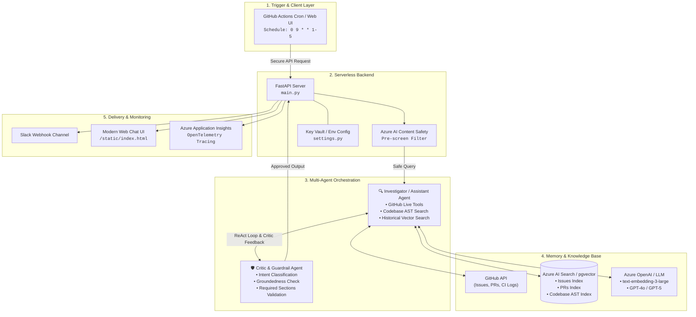

# 🚨 DevPulse: AI Engineering Intelligence Agent

A production-ready AI agent that helps engineering teams automate repository monitoring, PR stale reviews, and critical CI failure tracking by generating a morning briefing and real-time maintainer copilot using Multi-Agent orchestration, semantic memory vector search, and automated delivery.

---

## 🌟 Why this project exists

Engineering teams waste valuable time every morning checking dashboards, scrolling through active GitHub issues, tracking down stalest PRs, and checking which workflow runs failed.

This system acts as an AI-powered repository monitor, gathering data daily and analyzing the most critical issues.

The agent can:
* **Fetch and rank open issues, PRs, and CI workflow runs** directly via GitHub REST APIs.
* **Retrieve semantically similar past briefings and context** using high-dimensional vector search.
* **Run a deep multi-agent investigation (Investigator + Critic)** on top items to analyze root causes and inspect code ASTs.
* **Generate a summarized, clean morning briefing & diagnostic report** using state-of-the-art LLMs (GPT-4o / GPT-5 / Llama 3.3).
* **Deliver the structured report directly** to a Slack channel or interactive Web Chat UI.
* **Run securely on the cloud** with automated triggers, token authentication, and Content Safety guardrails.

---

## 🏗️ Architecture Overview



### High-level workflow:

1. **GitHub Cron schedule (GitHub Actions) / Web Trigger**
   * ➡️ Secure API request with IAM / Token Authentication
   * ➡️ FastAPI endpoint wakes up on containerized serverless hosting (Azure Container Apps / Cloud Run)
   * ➡️ Content Safety guardrail pre-screens incoming requests
   * ➡️ Vector search retrieves historical context and code snippets (pgvector / Azure AI Search + `text-embedding-3-large`)
   * ➡️ Multi-agent workflow executes (**Investigator ReAct loop + Critic validation**)
   * ➡️ LLM root cause analysis & structured briefing generation
   * ➡️ Deliver formatted briefing to Slack / Web UI with OpenTelemetry distributed tracing

### Core stack:

* **FastAPI** for high-performance async HTTP API endpoints and background tasks
* **Azure AI Foundry / LangGraph** for multi-agent coordination and ReAct loops
* **Azure AI Search / PostgreSQL + pgvector** for database semantic memory & HNSW indexing
* **Azure OpenAI (`text-embedding-3-large`)** for high-dimensional serverless embeddings (3072-dim)
* **Azure OpenAI (`gpt-4o` / `gpt-5`)** for quick, high-quality reasoning and AST code localization
* **Tree-sitter AST Parser** for structural code indexing (functions, classes, callers, imports)
* **Azure Content Safety & Application Insights** for enterprise safety filters and OpenTelemetry tracing
* **GitHub Actions & Docker** for automated cron triggering and containerized deployment

---

## 🤖 Key Features

### 🔍 Multi-Agent Deep Investigator
* **Investigator Node**: Operates as an autonomous ReAct agent using specialized tools to fetch issue timelines, comments, PR reviews, CI build error logs, and codebase AST snippets.
* **Critic Node**: Evaluates the investigator's reasoning against strict evaluation schemas. If it lacks sufficient evidence (e.g., claiming a "recurring pattern" without at least 2 distinct historical examples, or missing root cause / test coverage), it rejects the answer.
* **Episodic Memory Buffer**: On rejection, the critic's feedback is saved in a retry history buffer. The investigator uses this memory in the next iteration to correct mistakes and refine its diagnosis.

### 🧠 Semantic Memory Database
* **Historical Ingestion**: Ingests repository history, daily briefings, PR details, issues, and CI failures.
* **Dense Vector Embeddings**: Generates embeddings using `text-embedding-3-large` (3072 dimensions).
* **Exact Cosine Distance & Relevance Thresholding**: Queries the vector index using cosine distance operators (`<=>` / HNSW) and enforces strict relevance thresholds ($\ge 0.75$) to eliminate hallucinated precedents.
* **AST Codebase Indexing**: Indexes source files into structural symbols (functions, classes, called functions, line spans) via Tree-sitter.

### 🛡️ Secure Serverless API & Observability
* **Production-ready FastAPI backend** with structured Pydantic schemas and background ingestion tasks.
* **Content Safety Guardrail**: Pre-screens queries via Azure AI Content Safety against toxic or abusive content.
* **Distributed Tracing**: Fully instrumented with OpenTelemetry and Azure Application Insights for end-to-end trace observability.
* **Externalized Config**: Secured via Key Vault and environment variables.

---

## 💡 Example Use Cases

Automated briefings & maintainer copilot queries highlight:

* **Critical CI Failures**: Highlighting blocked runs, branch name, commit message, failed test job, and exact error traceback.
* **Stalest Open PRs**: Highlighting how many days they have been open and unmerged, changed files, and mergeability status.
* **Root Cause Deep Investigation**: E.g., *"Investigate issue #96050 (Turbopack crashes on Windows). Determine root cause status, locate buggy source files, and check if this is part of a recurring pattern."*
* **Fix & Test Recommendations**: Pinpoints exact file paths, line numbers, and suggests verification test cases.

---

## 📁 Project Structure

```text
devpulse/
├── agents/
│   ├── agent_graph.py          # 2-agent loop orchestrator (Assistant + Critic validation & retry)
│   ├── assistant_agent.py      # Maintainer Assistant ReAct agent (Foundry Responses API + Tool calling)
│   └── critic_agent.py         # Critic & Guardrail agent (JSON schema validation & intent routing)
├── config/
│   ├── azure_clients.py        # Azure OpenAI, Search, and AI Foundry client singletons
│   └── settings.py             # Centralized environment configurations & endpoint definitions
├── scripts/
│   ├── create_indexes.py       # Azure AI Search index definitions (Issues, PRs, Codebase AST)
│   ├── ingest_history.py       # GitHub historical issue ingestion & vector embedding pipeline
│   ├── repo_indexer.py         # Tree-sitter AST codebase indexer (classes, methods, callers)
│   ├── run_eval_benchmark.py   # Batch benchmark evaluation against merged GitHub PR ground truth
│   └── test_single_eval.py     # Single PR ground-truth evaluation & LLM judge scoring
├── static/
│   └── index.html              # Modern Dark-mode Glassmorphic Web Chat UI
├── tools/
│   ├── github_tools.py         # Live GitHub REST API fetchers (Issues, PRs, Actions CI logs)
│   ├── register_tools.py       # Azure AI Foundry FunctionTool schema registration script
│   └── search_tools.py         # Hybrid semantic search over issues and codebase indexes
├── main.py                     # FastAPI application server, endpoints & background tasks
├── requirements.txt            # Application Python packages
└── benchmark_results.json      # Ground-truth evaluation metrics and scoring results
```

---

## 🚀 Getting Started

### 1. Prerequisites
* Python 3.10+
* Azure OpenAI Service (with `text-embedding-3-large` and `gpt-4o` or `gpt-5` deployments)
* Azure AI Search resource (or PostgreSQL with `pgvector`)
* GitHub Personal Access Token (for GitHub REST API)

### 2. Installation

Clone the repository and install the dependencies:

```bash
git clone https://github.com/Saifali111/AI-Repo-Intelligence-Agent-Azure.git
cd devpulse_Azure
python3 -m venv venv
source venv/bin/activate
pip install -r requirements.txt
```

### 3. Environment Configuration

Create a `.env` file in the project root:

```env
# Azure OpenAI
AZURE_OPENAI_ENDPOINT=https://<your-resource>.openai.azure.com/
AZURE_OPENAI_KEY=<your-azure-openai-key>
AZURE_OPENAI_API_VERSION=2024-10-21
AZURE_OPENAI_DEPLOYMENT_NAME=gpt-4o
AZURE_OPENAI_EMBEDDING_DEPLOYMENT=text-embedding-3-large

# Azure AI Foundry Agent Service
AZURE_AI_PROJECT_ENDPOINT=https://<resource>.services.ai.azure.com/api/projects/<project-name>
AZURE_AI_AGENT_NAME=assistant-agent
AZURE_AI_CRITIC_NAME=critic-agent

# Azure AI Search
AZURE_SEARCH_ENDPOINT=https://<your-search-service>.search.windows.net
AZURE_SEARCH_KEY=<your-azure-search-key>
AZURE_SEARCH_ISSUES_INDEX=devpulse-issues-index
AZURE_SEARCH_CODE_INDEX=devpulse-codebase-index
AZURE_SEARCH_PRS_INDEX=devpulse-prs-index

# GitHub API & Target Repository
GITHUB_TOKEN=ghp_xxxxxxxxxxxxxxxxxxxx
DEFAULT_REPO=trpc/trpc
```

### 4. Initialize Indexes & Ingest Repository

```bash
# 1. Create vector search indexes
python3 -m scripts.create_indexes

# 2. Register tools with Azure AI Foundry
python3 -m tools.register_tools

# 3. Ingest issue history and embed with text-embedding-3-large
python3 -m scripts.ingest_history

# 4. Clone and index codebase AST with Tree-sitter
python3 -m scripts.repo_indexer
```

### 5. Run the Application

Start the FastAPI server:

```bash
uvicorn main:app --reload --port 8000
```

Open your browser at `http://localhost:8000` to interact with the modern Web Chat UI, or explore API docs at `http://localhost:8000/docs`.

---

## 📊 Ground-Truth Evaluation Benchmark

DevPulse includes an automated ground-truth evaluation benchmark (`scripts/run_eval_benchmark.py`) that tests the agent against real merged pull requests from target repositories:

| Metric | Target | Description |
| :--- | :--- | :--- |
| **Root Cause Alignment** | $1 - 5$ | Evaluates if the agent accurately diagnosed the underlying software bug |
| **Solution Accuracy** | $1 - 5$ | Compares proposed fix against the maintainer's merged PR patch |
| **File Localization Hit Rate** | $\%$ | Checks if the agent pinpointed the exact modified source files |

To run the evaluation suite:
```bash
python3 -m scripts.run_eval_benchmark --count 5
```

---

## 🔮 Future Improvements & Roadmap

* **GraphRAG Codebase Navigation**: Transition from basic AST indexing to full Knowledge Graph AST / GraphRAG to trace cross-file dependency call-chains and interface hierarchies.
* **Automated Fix PR Draft Generation**: Empower the Assistant Agent to create branch forks and draft Pull Requests with unit tests directly on GitHub.
* **Bi-directional Slack Bot Interaction**: Expand Slack notifications into an interactive conversational bot allowing maintainers to run deep-dives and approve PR reviews directly via Slack threads.
* **Multi-Repository Orchestration**: Support continuous monitoring across entire GitHub Organizations and multi-repo monorepos simultaneously.
* **Fine-Tuned Specialized Critic Models**: Train lightweight, domain-specific evaluator models for specialized test harness validation and security vulnerability scanning.

---

## 🙏 Acknowledgements

* **[Azure AI Foundry](https://ai.azure.com/)** & **[Azure OpenAI Service](https://azure.microsoft.com/en-us/products/ai-services/openai-service)** for scalable LLMs and agent orchestration infrastructure.
* **[Azure AI Search](https://azure.microsoft.com/en-us/products/ai-services/ai-search)** for hybrid vector search and HNSW indexing capabilities.
* **[FastAPI](https://fastapi.tiangolo.com/)** for the asynchronous web framework.
* **[Tree-sitter](https://tree-sitter.github.io/tree-sitter/)** for multi-language AST code parsing.
* **[GitHub REST API](https://docs.github.com/en/rest)** for repository events, issue timelines, and workflow run telemetry.
* The open-source community and maintainers whose daily workflows inspired this project.

---

## 📄 License

This project is licensed under the MIT License - see the [LICENSE](LICENSE) file for details.

